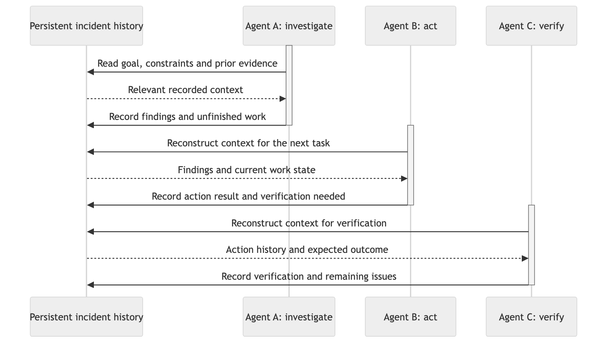

# Decklog

*Durable incident context for short-lived agents — a research project. The name evokes the ship's logbook that persists across watch rotations.*

**Status: research stage** — design discussion only. Nothing in this repository is implemented or evaluated yet; there is no runtime, no benchmark, and no installable artifact.

## The question

An incident can outlive the agent investigating it. This project studies a design in which an incident's working context lives in a durable, authoritative event history while execution agents are short-lived and bounded — contrasted with designs where one long-lived agent accumulates the context, or a central LLM orchestrator routes every step's context and results through itself.

We ask a more precise question:

> **What state, context, progress, and responsibility must persist — outside any single execution agent — for a newly spawned agent to continue a piece of incident work correctly?**

The ability to terminate or restart an agent is not the contribution. The open problem is the *consumption contract* between a durable history and bounded execution: what a fresh agent must read, what it must write back, and how responsibility transfers across join, readiness, progress, suspension, replacement, and termination.

## Prior work

These ideas sit on substantial prior art — event-sourced agent histories, virtual actors, durable execution, and shared-log semantics all already exist, and several systems implement pieces of what we describe. Any comparison must credit that work fairly rather than treat this space as empty. See [docs/related-work.md](docs/related-work.md) for the curated table with links.

## A small SRE narrative

03:12 — an alert fires for elevated error rates on a payments service. An investigation agent joins, reads the incident goal and constraints from the history, gathers evidence, records findings plus an unfinished obligation ("suspect deploy r2026-09-19-4; rollback only if the recorded safety conditions hold"), and is terminated. Later an action agent is spawned: it inherits no conversation, reconstructs context, assesses the recorded constraints against current evidence — and because the safety conditions hold, performs a bounded rollback step, recording the result plus "verification needed." Had they not held, its job would be to record why it cannot act. A third agent later verifies the fix against the recorded expected outcome.

Continuity persists across these bounded execution windows; no single agent needs to live through the whole incident.

*One proposed sequential example ([Mermaid source](docs/assets/lifecycle-concept.mmd)). Activation bars represent bounded execution windows — an agent reconstructing context, acting, and recording. They do not depict a mandatory pipeline, a guaranteed scheduler, or an implemented N:M runtime.*

## What the shared history is

The log we study is not metrics or operational telemetry. It records goals, constraints, conversation, observations, hypotheses, decisions, action requests and results, and the evidence and revisions relating them. It is authoritative about what was recorded — not proof that every assertion in it is true. Observation itself is an action the agent chooses from reconstructed context, not a passive feed.

**N:M** means multiple producers and multiple consumers of that history: a given agent can be both, recording outcomes and obligations while consuming the context its task needs. No consumer need receive the full history — each reconstructs a task-relevant view. Concurrent or independently scoped work is possible in this model; which rules coordinate it (ordering, ownership, admission) is part of the research question, not a promised scheduler.

## Hypotheses, not results

- Central LLM orchestration may incur avoidable handoff cost: each step re-serializes context through the coordinator, which also becomes a dependency for continuity.
- A durable shared history plus short-lived agents that reconstruct only the context their task needs may reduce that dependency — or shorter lifetimes may instead raise reconstruction cost. Break-even is an empirical question.
- Decentralization is an option to evaluate, not a claimed benefit. The comparison itself is the experiment.

## Planned evaluation (no results yet)

Coordination strategy and execution lifetime are separate axes. Candidate strategies: durable centralized LLM orchestration, rule-based dispatch over the shared history, and N:M consumer-driven coordination — with agent lifetime varied where applicable and persistence, tools, model, and task conditions held comparable across arms. SRE incident/ticket scenarios are the evaluation domain. Planned metrics: correct-continuation rate after agent replacement or suspension, tokens/context bytes per completed unit of work, duplicate or contradictory external actions, and recovery behavior under injected faults. These are plans, not claims.

## Where things are

- [docs/research/questions.md](docs/research/questions.md) — open research questions and the hypotheses behind them
- [docs/related-work.md](docs/related-work.md) — curated prior work with citations
- [docs/research/README.md](docs/research/README.md) — how the research docs are organized
- [CONTRIBUTING.md](CONTRIBUTING.md) — how to discuss or propose research

## Contributing and discussion

Discussion happens in [GitHub issues](https://github.com/ahwlsqja/decklog/issues). Contributions at this stage mean research questions, critiques, and reproducible evidence — see [CONTRIBUTING.md](CONTRIBUTING.md).

## License

[Apache-2.0](LICENSE)
