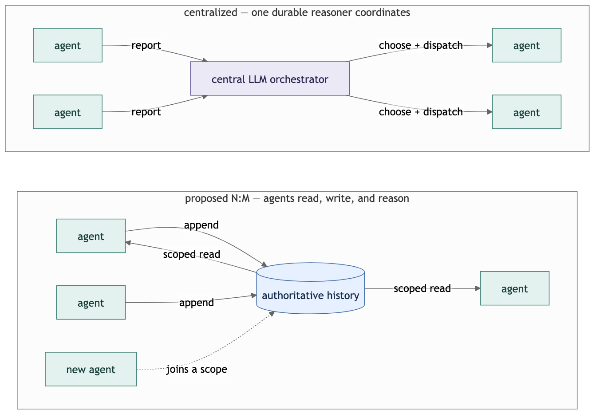
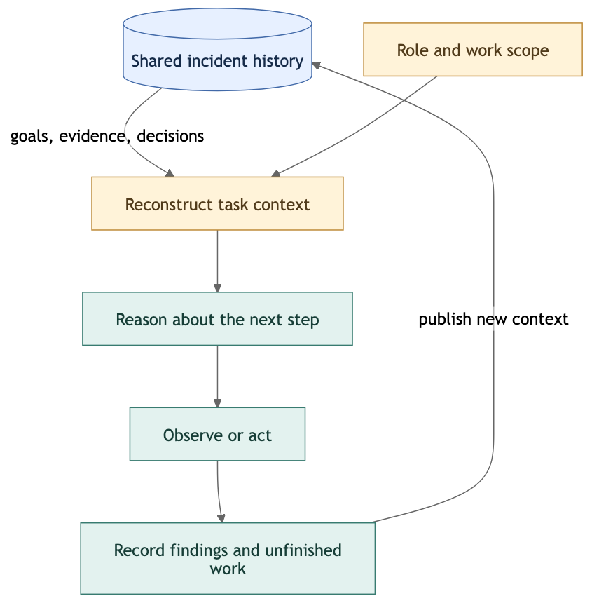
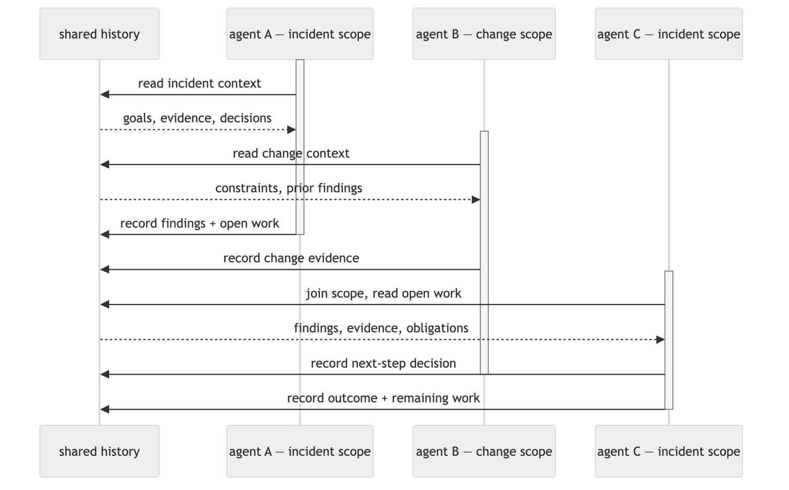

# Decklog

  

**Incidents outlive agents.**

Decklog explores N:M collaboration among short-lived SRE agents over a durable, shared history of incident context. Agents join relevant work, reconstruct what matters, reason and act, and leave context that others can continue from.

Distributed systems already use durable logs and derived views to separate continuing state from replaceable execution. We ask what that separation means when the readers and writers are reasoning agents.

> Can SRE work continue through a changing population of agents without making every coordination decision depend on one long-lived LLM orchestrator?

[Model](#nm-participation-producers-consumers-work-scopes) · [Context](#context-is-a-projection-not-a-transcript) · [Lifetimes](#bounded-executions-persistent-responsibility) · [Questions](#open-research-questions) · [Development](#development)

*The coordination model under study ([Mermaid source](assets/coordination.mmd)): incident context lives in a durable, shared history that agents read and write.*

**Research stage:** defining the model and experiments — nothing in this repository is implemented or evaluated yet.

## A night in an incident

03:12 — an alert fires: elevated 5xx on a payments service. A work scope, `incident/payments-5xx`, opens with the goal and constraints recorded.

An investigation agent subscribes, reconstructs the context its task needs — goal, constraints, recent observations — gathers evidence, and appends findings plus an unfinished obligation: *"suspect deploy r2026-09-19-4; rollback only if the recorded safety conditions hold."* Then it terminates. A second agent on the neighboring scope `change/r2026-09-19-4` joins the incident scope by subscription, recording that the deploy touched the payments config path.

Later an action agent is spawned. It inherits no conversation; it reconstructs the scope's history, checks the safety conditions against current evidence, and because they hold, performs a bounded rollback — recording the result plus a new obligation, *"verification needed."* Had they not held, its job would be to record why it cannot act. A fourth agent verifies the fix against the recorded expected outcome.

Continuity lived on the scopes, not in any agent.

## Where the reasoning sits

In the orchestrated SRE designs this project studies, a central LLM is not plumbing — it is an **active reasoner**. Every coordination decision costs an inference: read the reports, reconstruct enough of the situation to choose the next step, repackage context for the dispatched worker. Dependency, latency, and token cost concentrate in one place. Durable central orchestrators persist, recover, and coordinate parallel work well — the question is not whether they function, but whether every coordination decision must depend on one long-lived reasoner.

The log design does not make reconstruction free — it relocates and multiplies it: K cold-starting agents may pay K reconstructions where an orchestrator paid for warm-context passes. Whether the trade pays depends on how much history each task actually needs. **That break-even is the experiment.**

## N:M participation: producers, consumers, work scopes

The mechanism under study is scoped participation. Work organizes into scopes — `incident/payments-5xx`, `change/r2026-09-19-4` — that behave like topics: agents subscribe to a scope to discover and join its ongoing work, and one agent can span several scopes.

| Role | What it does |
| --- | --- |
| Producer | Appends to a scope's history: goals, constraints, evidence, hypotheses, decisions, action results, obligations |
| Consumer | Reconstructs a task-scoped view of a scope's history and acts from it |
| Both | The common case — every acting agent also records, becoming context for whoever comes next |

This is more than sharing a transcript — consumers materialize views rather than replaying a firehose — and more than swapping one orchestrator process for another. Subscription, activation, admission, and ownership rules are themselves research questions: the goal is to reduce dependency on central reasoning, not to make coordination infrastructure vanish.

## Context is a projection, not a transcript

The authoritative log carries the situation's context and its evolution: intent, goals, constraints, conversation, evidence, hypotheses, decisions, actions and results, relationships and revisions, unfinished obligations. It is authoritative about *what was recorded* — a recorded assertion is a claim to check, not ground truth. Raw metrics and telemetry can appear as evidence entries; they are not the log itself.

Participants reconstruct the views their tasks need; the design does not require every agent to read the full history. Triage takes goal, constraints, and recent observations; verification takes the decision, expected outcome, and recorded result; a joiner takes one obligation and its evidence chain. How projections are computed — selective retrieval, summarization, replay — is deliberately undecided.

Observation is part of the same loop: deciding *what to look at next* is itself an action chosen from reconstructed context, and the new observation is appended for whoever comes after.

*Read it as a cycle ([Mermaid source](assets/context-cycle.mmd)): reconstruct a task-scoped view — a projection, not a copy — reason about what to observe or do, act, then append the new records back to the log as context for the next participant.*

## Bounded executions, persistent responsibility

Executions are short; obligations persist. The lifecycle under study — spawn, readiness, consumption, progress, waiting, suspension, replacement, termination — raises the real question: how does responsibility survive those boundaries?

Recorded order alone does not grant authority to act. If two agents reconstruct contexts in which the same action is warranted, appending to the log does not by itself stop both — and external effects are not transactional with the log. One candidate mechanism we intend to test: make *claiming* an obligation a versioned entry in the log, checked and enforced by an execution protocol — admission as an explicit mechanism, not a property history provides for free. Whether that suffices is open — a research direction, not a chosen implementation.

*A bounded-overlap example ([Mermaid source](assets/agent-lifetimes.mmd)): two executions overlap on different scopes of one persistent shared history — an incident-scope agent records findings and open work, then ends while a change-scope execution is still running; a fresh incident-scope execution joins afterward, reads the recorded open work and evidence, and records its own decision and outcome. Continuity lives on the shared history, not in an agent — and a recorded entry alone grants no authority to act.*

## What would make this worth doing

The ambitions, stated positively:

- **Lower central dependency** — continuity that does not require one reasoner to stay alive and attentive for the whole incident.
- **Natural participation** — agents join and leave ongoing work through scopes and subscriptions.
- **Scaling by participants** — more agents working more scopes, rather than one context growing to hold everything.
- **Continuity with correctness** — constraints, evidence, and obligations surviving agent replacement.

Falsifiers: reconstruction cost per cold join exceeding the warm-context passes it replaces; acceptable-continuation criteria undefinable per task; stale or conflicting context that cannot be bounded; duplicate external effects preventable only by routing decisions back through one long-lived reasoning hub. Correctness is not identical model output — several next actions may be valid; the target is preserved constraints, evidence, obligations.

## Open research questions

1. **Minimal sufficient record.** Which fields — goal, constraints, decisions, pending obligations, evidence pointers — must an entry carry for a fresh agent to continue within task-defined acceptable-continuation criteria?
2. **Scopes and coordination boundaries.** How should work scopes be defined and governed so N:M producers and consumers can find, join, and split work — and which coordination decisions genuinely require global reasoning rather than scoped, local ones?
3. **Reconstruction cost vs. lifetime.** How does rehydration cost grow as lifetimes shrink, and where is break-even against a durable warm-context orchestrator?
4. **Concurrent writers, external effects.** What combined contract — consumption rules, obligation claims, commit protocol — prevents double execution or forked responsibility? Where must tool-side idempotency take over?
5. **Chosen observations.** If what to observe is decided from reconstructed context, how do we detect an agent observing the wrong thing because reconstruction dropped relevant state?

## How we plan to evaluate

Coordination strategy and execution lifetime are **independent axes**. Candidate strategies: durable centralized LLM orchestration, rule-based dispatch over the shared history, and N:M consumer-driven coordination — lifetime varied where applicable, persistence/tools/model/tasks held comparable. The domain is SRE incident/ticket scenarios.

| Planned metric | What it probes |
| --- | --- |
| Correct-continuation rate after replacement or suspension | Context survival across execution boundaries |
| Tokens / context bytes per completed unit of work | The reconstruction break-even question |
| Duplicate or contradictory external actions | Whether the claim/admission contract holds |
| Recovery behavior under injected faults | Fault tolerance of each coordination shape |

These are plans, not results; no arm is the predicted winner.

## Lineage

These ideas sit on substantial prior art — what we build on, and what a fair evaluation must compare against. This table is curated, not exhaustive.

| Work | What it establishes | Relevance to Decklog | Reference |
| --- | --- | --- | --- |
| The Log is the Agent | Event-sourced agent-activity graph with replay, fork, diff, lineage; distributed writer ordering unresolved | Closest framing; its open ordering question is one of ours | [arXiv 2605.21997v1](https://arxiv.org/html/2605.21997v1) |
| ActiveGraph | Views, Frames, frame-aware prompt construction, resume, snapshot/archive compaction | Much of the task-scoped reconstruction machinery exists here | [README @ 8aedb18](https://github.com/yoheinakajima/activegraph/blob/8aedb1866cf5dce056af97529152ffd6f468a1ed/README.md) |
| Orleans virtual actors | Identity separated from activation — addressable whether or not executing | Agent identity vs. ephemeral execution is established | [Microsoft Learn](https://learn.microsoft.com/en-us/dotnet/orleans/overview) |
| Temporal | Centralized logical orchestration with persisted, recoverable state | A fair durable-centralized baseline — must not be handicapped | [Temporal docs](https://docs.temporal.io/temporal-service/temporal-server) |
| Kafka consumer semantics | Partition positions, committed offsets, independent subscribers, replacement consumers | N:M consumption vocabulary; a topic is neither global order nor ownership of side effects — inspiration and possible substrate, not a chosen dependency | [KafkaConsumer javadoc (4.1)](https://kafka.apache.org/41/javadoc/org/apache/kafka/clients/consumer/KafkaConsumer.html) |
| Kreps, "The Log" | The shared log as a unifying abstraction for state and data integration | The general motivation applied here to incident context | [LinkedIn Engineering](https://www.linkedin.com/blog/engineering/distributed-systems/log-what-every-software-engineer-should-know-about-real-time-datas-unifying) |

## Development

Discussion happens in [GitHub issues](https://github.com/ahwlsqja/decklog/issues). Contributions at this stage mean research questions, critiques, prior-work corrections, and reproducible evidence; runtime and experiment code are the planned next stage, proposed through issues first — see [CONTRIBUTING.md](CONTRIBUTING.md). The name evokes the ship's logbook that persists across watch rotations.

## License

[Apache-2.0](LICENSE)
